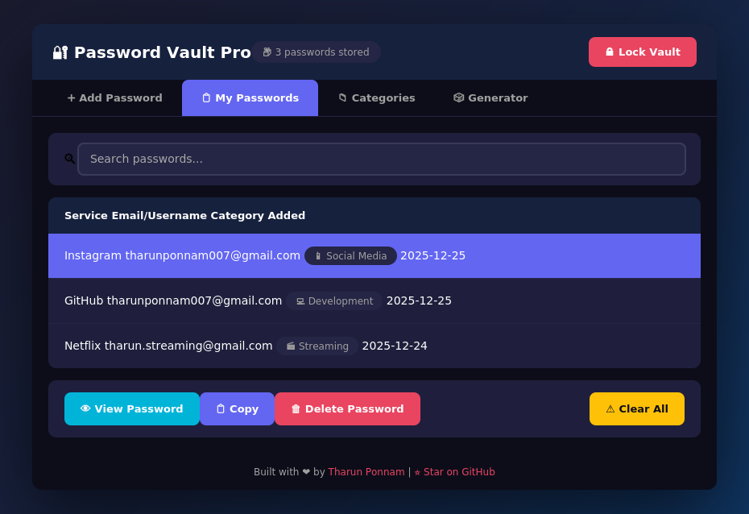

<p align="center">
  
</p>

<h1 align="center">🔐 Password Vault Pro</h1>

<p align="center">
  <strong>A modern, feature-rich password manager with beautiful dark UI</strong>
</p>

<p align="center">
  <a href="#-features">Features</a> •
  <a href="#-live-demo">Live Demo</a> •
  <a href="#-installation">Installation</a> •
  <a href="#-screenshots">Screenshots</a> •
  <a href="#-architecture">Architecture</a>
</p>

<p align="center">
  
  
  
  
</p>

---

## 🎯 Overview

Password Vault Pro is a **secure, offline password manager** with a stunning dark-themed interface. Built entirely with Python's standard library, it offers enterprise-level features like master password protection, password recovery options, smart service categorization, and password strength analysis—all without any external dependencies.

<p align="center">
  
</p>

---

## 🚀 Live Demo

Experience Password Vault Pro directly in your browser! No installation required.

<p align="center">
  <a href="https://tharun-ship-it.github.io/password-vault/">
    
  </a>
</p>

> **Demo Password:** `demo123`

---

## ✨ Features

### 🎨 Modern Dark UI
- Beautiful gradient dark theme
- Smooth animations and hover effects
- Intuitive tabbed interface
- Responsive design

### 🔒 Security Features
| Feature | Description |
|---------|-------------|
| **Master Password** | SHA-256 hashed protection |
| **Password Strength Meter** | Real-time strength analysis |
| **Password Recovery** | Email & hint-based recovery |
| **Local Storage** | All data stored locally—no cloud |

### 📂 Smart Organization
- **8 Pre-built Categories**: Social Media, Streaming, Email, Development, Cloud Storage, Finance, Shopping, Work
- **50+ Service Suggestions**: Quick-add buttons for popular services
- **Search & Filter**: Instantly find any password
- **Category Browser**: Visual grid of all supported services

### ⚡ Quick Actions
- One-click service addition (Gmail, GitHub, Netflix, etc.)
- Auto-category detection
- Bulk delete with confirmation
- Password visibility toggle

---

## 📦 Installation

### Prerequisites
- Python 3.7 or higher
- Tkinter (included with most Python installations)

### Quick Start

```bash
# Clone the repository
git clone https://github.com/tharun-ship-it/password-vault.git
cd password-vault

# Run the application
python src/vault.py
```

### Install as Package

```bash
pip install -e .
password-vault  # Run from anywhere
```

---

## 📸 Screenshots

### Login Screen
Secure master password authentication with password recovery options.

### Add Password Tab
Quick-add buttons, form validation, and real-time password strength indicator.

### My Passwords Tab
Searchable list with category tags, view/delete actions, and bulk operations.

### Categories Browser
Visual grid of 50+ services organized into 8 categories for quick addition.

---

## 🏗 Architecture

```
password-vault/
├── src/
│   ├── __init__.py           # Package initialization
│   └── vault.py              # Main application (700+ lines)
├── tests/
│   └── test_vault.py         # Unit tests
├── assets/
│   └── screenshot.png        # App screenshot
├── index.html                # Live demo (GitHub Pages)
├── .github/
│   └── workflows/ci.yml      # CI/CD pipeline
├── requirements.txt          # Dependencies (none!)
├── setup.py                  # Package config
├── pyproject.toml           # Modern Python config
├── LICENSE                   # MIT License
└── README.md                 # This file
```

### Data Storage

```
~/.password_vault_pro/
├── config.json    # Master password hash, recovery email, hint
└── vault.json     # Stored credentials (JSON format)
```

### Security Model

| Component | Implementation |
|-----------|----------------|
| Master Password | SHA-256 hash (never stored plain) |
| Recovery Options | Email + custom hint |
| Password Display | Masked with reveal option |
| Storage | Local filesystem only |

---

## 🧪 Testing

```bash
# Run unit tests
python -m pytest tests/ -v

# Run with coverage
python -m pytest tests/ --cov=src --cov-report=html
```

---

## 🛣 Roadmap

- [x] Master password with recovery
- [x] Password strength indicator
- [x] Category-based organization
- [x] Quick-add service buttons
- [x] Search and filter
- [x] Live web demo
- [ ] Password generator
- [ ] Export/import (CSV, JSON)
- [ ] Browser extension
- [ ] Mobile companion app

---

## 🤝 Contributing

Contributions are welcome! Please read the [Contributing Guide](CONTRIBUTING.md) first.

```bash
# Fork and clone
git clone https://github.com/YOUR_USERNAME/password-vault.git

# Create branch
git checkout -b feature/amazing-feature

# Commit and push
git commit -m 'Add amazing feature'
git push origin feature/amazing-feature

# Open Pull Request
```

---

## 📄 License

This project is licensed under the MIT License—see the [LICENSE](LICENSE) file for details.

---

<p align="center">
  <strong>Built with ❤️ by <a href="https://github.com/tharun-ship-it">Tharun Ponnam</a></strong>
</p>

<p align="center">
  <a href="https://github.com/tharun-ship-it/password-vault/stargazers">
    
  </a>
  <a href="https://github.com/tharun-ship-it/password-vault/network/members">
    
  </a>
</p>
